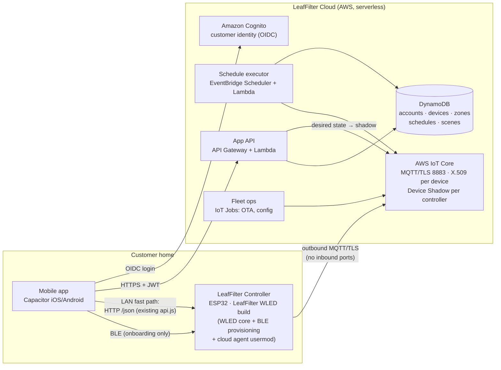
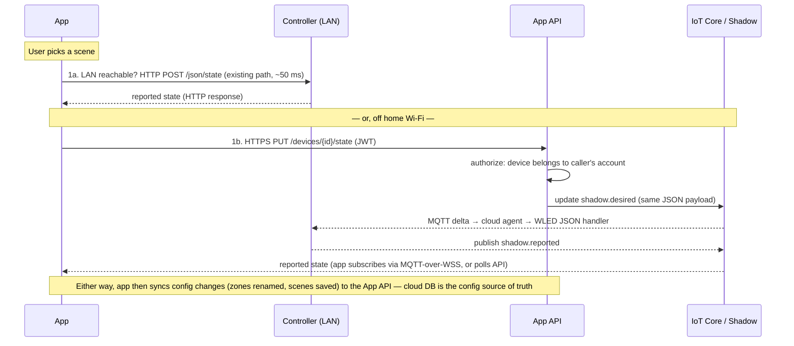

# Lighting by LeafFilter — Backend & Connectivity Architecture Proposal

**Status:** Draft for IT/architecture review
**Date:** 2026-07-01
**Scope:** Backend, connectivity, device provisioning, scheduling execution, and authentication for the Lighting by LeafFilter product (mobile app + ESP32/WLED roofline controllers).

**Design inputs (confirmed with product owner):**

| Input | Decision |
|---|---|
| Scale target (years 1–2) | 10k–100k+ installed homes |
| Remote access (off home Wi-Fi) | Must-have at launch |
| Hosting/operations | No vendor mandate — recommendation requested |
| Security bar | Enterprise review: per-device identity, TLS everywhere, formal threat model, auditability |

---

## 1. Where the product is today

The shipping prototype is a Capacitor (iOS/Android) app in vanilla JS. There is **no backend of any kind**. Concretely:

- **State** lives in one in-memory object, snapshotted to `localStorage` (`lf_state_v2`) every 2 s (`src/main.js`). The customer's phone is the only place their configuration (controllers, zones, schedules, scenes) exists. Lose the phone, lose the install record.
- **Device control** is direct, unauthenticated HTTP to the WLED JSON API on the controller's LAN IP (`src/api.js`). A single hub IP is stored in `localStorage`; multi-controller is stubbed. There is no path to the device when the phone is not on the home network.
- **Onboarding** pairs over BLE (`src/ble.js`): the app sends Wi-Fi credentials over a custom GATT service and receives the controller's IP. The GATT service UUIDs are placeholders — **the firmware side of this does not exist yet**, so custom firmware work is already on the critical path regardless of backend choice.
- **Scheduling** is a complete UI (time/sunset/sunrise triggers, weekday/seasonal repeats, vacation mode with randomized on/off) with a no-op `syncSchedules()` stub. No schedule has ever fired.
- **No accounts.** The onboarding "Sign In" button is decorative. There is no source of truth for which customer owns which controller — which also means no support/warranty story ("what firmware is Mrs. Smith's controller on?") and no install-base visibility.

### What the WLED platform gives us (and doesn't)

The controller is LeafFilter-owned hardware (ESP32, QuinLED Dig-Quad class, max 4 outputs/zones) running WLED firmware. Relevant capabilities:

| Capability | Status in stock WLED | Implication |
|---|---|---|
| Local HTTP JSON API | ✅ Full control surface (already used by `api.js`) | Keep as the LAN fast path |
| On-device schedule timers | ✅ Up to 16 "time-controlled presets": time-of-day, weekday masks, date ranges, sunrise/sunset (needs NTP + lat/lon) | Usable as an **offline fallback** for basic schedules; not rich enough for the app's full model (per-zone scenes, vacation randomization) |
| MQTT client | ⚠️ Present, but **no TLS** in stock builds and shared-topic model | Cannot meet the enterprise bar as-is; needs firmware work |
| Cloud / remote access | ❌ None | Must be built |
| API authentication on LAN | ❌ Effectively none (HTTP, no tokens) | Acceptable only inside the home-LAN trust boundary; documented as residual risk |
| OTA updates | ⚠️ Manual per-device (web UI upload / DDP) | Fleet OTA must be built for a 100k fleet |

**Key consequence:** any architecture that meets "remote access at launch + enterprise security" requires a **custom WLED firmware build** ("LeafFilter WLED") — but we already need one for BLE provisioning, so this adds a component to a build we must own anyway, not a new obligation.

---

## 2. Options considered

### Option A — Local-first, no cloud (rejected, but its LAN path survives)

The app remains the brain. Schedules are pushed into WLED's 16 on-device timers; discovery via mDNS; state stays on the phone.

- **Remote access:** none, or consumer VPN hacks (Tailscale-style) that are not shippable to this demographic. **Fails a launch requirement.**
- **Accounts / ownership source of truth:** none. Fails the support and warranty story.
- **Scheduling:** basic on/off works offline; the app's richer model (per-zone scenes, seasonal, vacation randomization) exceeds the 16-timer budget.
- **Security:** smallest attack surface of all options (nothing exposed off-LAN); no cloud PII.
- **Cost/ops:** ~zero.

**Verdict:** rejected as the product architecture, but its direct-LAN control path is genuinely valuable (zero-latency control, works during internet outages) and is **retained as the preferred transport inside the hybrid recommendation (Option B)**. On-device timers are likewise retained as the offline scheduling fallback.

### Option B — Cloud-connected hybrid on a managed IoT platform (recommended)

Devices maintain an always-on outbound MQTT/TLS connection to a managed IoT core with per-device X.509 identity. The cloud holds the source of truth (accounts, device registry, zones, schedules, scenes) and executes schedules. The app talks HTTPS to a thin API; for live control it uses **the LAN directly when it can reach the controller, and the cloud path when it can't** — same JSON payloads either way.

Detailed in §3 onward.

### Option C — Third-party device cloud (buy, not build)

Platforms like Golioth, Blynk, or Tuya-class white-label clouds provide connectivity, fleet management, and OTA off the shelf.

- **Speed:** fastest to a demo; months saved up front.
- **Cost at our scale:** per-device platform fees typically land at **$0.10–$1.00+/device/month** → **$120k–$1M+/year at 100k devices**, versus low tens of thousands/year self-hosted on Option B (see §8). The economics invert hard at fleet scale.
- **Strategic fit:** LeafFilter deliberately removed the Tuya dependency to own the controller and app; reintroducing a third-party cloud as the system's spine reverses that decision. Data residency, breach posture, and roadmap are theirs, not ours — a hard sell in an enterprise review.
- **Lock-in:** firmware agents and device identity are platform-proprietary; migrating a 100k fleet later means an OTA campaign and re-provisioning.

**Verdict:** rejected for the spine. (Narrow "buy" decisions remain inside Option B: identity via Cognito, sunset calculation via a library, etc.)

### Trade-off summary

| Dimension | A: Local-first | **B: Cloud hybrid (recommended)** | C: Third-party cloud |
|---|---|---|---|
| Remote access | ❌ None | ✅ Native, at launch | ✅ Native |
| Offline behavior | ✅ Best | ✅ LAN control + on-device timer fallback | ⚠️ Varies; LAN path often absent |
| Scheduling execution | ⚠️ Basic only (16 timers) | ✅ Full model in cloud + basic offline fallback | ✅ Platform scheduler (model limits vary) |
| Security (enterprise bar) | ✅ Smallest surface / ❌ no identity, no audit | ✅ Per-device certs, TLS, least-privilege topics, audit logs | ⚠️ Inherited from vendor; limited transparency |
| Accounts & ownership registry | ❌ | ✅ | ✅ |
| Hosting cost (100k homes) | ~$0 | ~$3–8k/month (§8) | ~$10–85k+/month |
| Ops burden | None | Moderate (managed/serverless keeps it lean) | Low |
| Vendor lock-in | None | Cloud-vendor level (mitigable: standard MQTT + shadow pattern) | Deep (firmware + identity + data) |
| Firmware work | BLE provisioning only | BLE provisioning + cloud agent + OTA | Vendor SDK integration |

---

## 3. Recommended architecture (Option B)

**Recommended platform: AWS IoT Core** as the device plane, with serverless AWS services around it. Rationale: the most mature fleet-provisioning and per-device-certificate story at 100k+ scale, pay-per-use pricing that starts near zero for the pilot, and the Device Shadow pattern that maps almost one-to-one onto WLED's existing JSON state document. **If Leaf Home IT standardizes on Azure, the identical architecture maps to Azure IoT Hub (device twins), Azure Functions, Cosmos DB, and Entra External ID** — the design below is expressed so that this substitution is a naming change, not a redesign. This vendor call should be settled in the review.

### 3.1 Component diagram



### 3.2 The one idea that makes this cheap to build

WLED's control surface is a JSON state document (`/json/state`), and the app already speaks it (`api.js`). The AWS Device Shadow is *also* a JSON state document with `desired`/`reported` halves. So:

- The **shadow `desired` payload is the same JSON the app already POSTs to `/json/state`** (segments, colors, fx, bri, on).
- The firmware **cloud agent** subscribes to shadow deltas and feeds them into WLED's existing internal JSON-API handler (the same code path the HTTP server uses), then publishes `reported` state back.
- `api.js` grows a **transport selector**, not a rewrite: *"can I reach the controller on the LAN? → HTTP direct (today's code, unchanged). No? → write the same payload to the device's shadow via the App API."* The `state.controllers[]` model and the whole `api.js` call surface (`setPattern`, `applyScene`, `setBrightness`, `setLightsOn`, `setZoneActive`) survive intact.

This satisfies the standing constraint that the current data model and API surface evolve without a rewrite, and it keeps the LAN path — zero-latency control and full functionality during internet outages — as a first-class citizen rather than dead code.

### 3.3 Command data flow (control a light)



Conflict rule: the shadow (i.e., the device's `reported` state) always wins for *live light state*; the cloud DB always wins for *configuration* (zone names, schedules, scenes, ownership). The phone's `localStorage` becomes a cache, not the record.

### 3.4 Provisioning & ownership (onboarding)

Builds directly on the existing BLE flow in `ble.js`/`onboarding.js`; adds identity and claiming.

```mermaid
sequenceDiagram
    participant U as App (customer logged in)
    participant C as Controller
    participant A as App API
    participant S as AWS IoT

    Note over C: Factory: firmware ships with a shared, low-privilege<br/>CLAIM certificate + unique serial (in secure element / NVS)
    U->>C: BLE pair → read device info (serial, firmware) [existing flow]
    U->>C: BLE write Wi-Fi credentials over encrypted session [existing flow + §6 hardening]
    C->>C: joins Wi-Fi, gets IP, NTP sync
    C->>S: Fleet Provisioning: connect with claim cert,<br/>request unique identity (CSR w/ serial)
    S-->>C: unique X.509 device cert + least-privilege policy<br/>(pub/sub only lf/{thingName}/# and its own shadow)
    U->>A: POST /devices/claim {serial, proof-of-possession token read over BLE}
    A->>A: bind device → customer account in registry (DynamoDB)
    A-->>U: device claimed; zones auto-provisioned from reported cfg (hw.led.ins),<br/>mirroring today's reconcileZonesWithHardware logic server-side
```

- **Proof of possession:** claiming requires a short-lived token readable only over BLE (physical proximity), so a serial number alone can never hijack a device.
- **Resale/return:** factory-reset wipes the device cert and re-enters claim mode; the API unbinds the registry entry and revokes the old cert. This flow is an explicit deliverable, not an afterthought — 100k-fleet products always face it.
- **Multi-controller homes** fall out naturally: the registry holds N devices per account; the app's `state.controllers[]` array is hydrated from `GET /devices`, replacing the single `leaflight_hub_ip` global.

### 3.5 Scheduling execution

Schedules finally *fire*, and they fire whether or not the phone exists:

- **Source of truth:** schedule entities in DynamoDB, written by the app through the API (replacing the `syncSchedules()` stub). The existing UI model (trigger: time/sunset/sunrise, repeats incl. seasonal date ranges, per-zone targeting, vacation mode) maps directly.
- **Executor:** a **daily materializer** (per home, runs after midnight local time) computes the next 24 h of concrete fire times — resolving sunset/sunrise from the home's stored lat/lon, expanding repeat rules with correct timezone/DST handling, and generating that night's randomized on/off pair for vacation mode. Each fire time becomes an **EventBridge Scheduler one-shot** → Lambda → shadow `desired` update targeting the scheduled zones/scene.
- **Offline resilience:** the executor also keeps the controller's **native WLED timers** synced with a simplified fallback (e.g., "sunset → last-applied evening scene, 23:30 → off") so the lights behave sanely through internet outages. Documented degradation: fancy schedules pause; basic on/off does not.
- **Idempotency & audit:** every fired schedule writes an execution record (device, schedule id, result, reported-state confirmation) — this powers both support diagnostics and the audit trail the review will ask about.

### 3.6 Authentication model

| Leg | Mechanism |
|---|---|
| Customer → app | Amazon Cognito user pool (email/password + Apple/Google sign-in; SSO-capable via OIDC/SAML federation if Leaf Home later wants shared identity). MFA available. The onboarding "Sign In" button becomes real. |
| App → App API | OIDC JWT (Cognito) on every request; API authorizes against the account→device registry. No device data crosses accounts. |
| App → live device state (remote) | Via the App API, or MQTT-over-WSS with Cognito Identity credentials mapped to an IoT policy scoped to the account's device topics (phase 2 optimization for push updates). |
| Device → cloud | Unique per-device X.509 client certificate, mutual TLS on 8883, IoT policy restricted to the device's own topics and shadow. No shared secrets in firmware images. |
| App → device (LAN) | Home-LAN trust boundary (see §6). BLE provisioning session encrypted with app-layer key exchange (§6), since BLE "Just Works" pairing alone is MITM-able. |
| Installers/support (internal) | Separate Cognito group / IAM-backed admin API with audit logging; support can view device health, never Wi-Fi credentials (which never leave the home — see §6). |

---

## 4. Data model (cloud)

Direct evolution of today's persisted shape (`lf_state_v2` fields → entities):

| Entity | Key fields | Today's equivalent |
|---|---|---|
| **Account** | id, email, name, home address (optional), lat/lon (for sunset; coarse, user-consented) | — (new) |
| **Device** | thingName, serial, accountId, model, firmwareVersion, certId, lastSeen | `controllers[i]` + `leaflight_hub_ip` |
| **Zone** | deviceId, segId, name, shortName, ledCount, pin | `controllers[i].zones[j]` (server-side mirror of `reconcileZonesWithHardware`) |
| **Scene** | accountId, name, colors[], movement, speed, brightness | `data/scenes.js` presets + user patterns |
| **Schedule** | accountId, trigger, timeVal/offsets, repeat, customDays, seasonal range, zoneIds[], sceneId, active | `state.schedules[]` (same shape) |
| **VacationConfig** | accountId, active, scene, behavior, on/off window | `vacation*` fields |
| **ScheduleExecution** (append-only) | scheduleId, deviceId, firedAt, result | — (new; audit/support) |

Phone `localStorage` remains as an offline cache with a sync layer (server timestamps win for config; shadow wins for live state).

---

## 5. Firmware plan ("LeafFilter WLED")

A maintained fork/usermod build of WLED — required regardless of backend choice, since the BLE provisioning service in `ble.js` has no firmware counterpart yet.

1. **BLE provisioning service** — implements the GATT service the app already codes against (`4c46…` UUIDs): device info (READ), Wi-Fi credentials (WRITE, encrypted per §6), connection status (NOTIFY), plus the claim proof-of-possession token characteristic.
2. **Cloud agent usermod** — mutual-TLS MQTT (port 8883, outbound only) to IoT Core using the device certificate; shadow delta → WLED JSON handler; reported-state publisher (debounced); health telemetry (RSSI, uptime, fw version, power state) every few minutes.
3. **OTA via IoT Jobs** — signed firmware images, staged rollout (1% → 10% → fleet), automatic rollback on boot-loop. Non-negotiable for patching a 100k fleet at the enterprise bar.
4. **Fallback timers sync** — accept simplified schedule fallback from the cloud into WLED's native timers.

**Feasibility note for review:** TLS on ESP32 (mbedTLS) alongside WLED's LED pipeline is workable but memory-tight on 4 MB WROOM parts; this must be validated on the actual Dig-Quad-class board early (Phase 1 spike). Mitigations if tight: PSRAM/WROVER or ESP32-S3 module on the next board rev, or trimming unused WLED features from the build. This is the single biggest technical risk in the proposal and is called out as such.

---

## 6. Security considerations (threat-model summary)

**Trust boundaries:** (1) BLE proximity during onboarding, (2) home LAN, (3) public internet ↔ cloud, (4) cloud internal.

| Threat | Mitigation |
|---|---|
| Wi-Fi credentials sniffed during BLE onboarding | App-layer ECDH session encryption over the GATT link (BLE "Just Works" pairing is MITM-able on its own); credentials go phone→device only and **never touch the cloud** |
| Stolen serial used to claim someone's device | Claim requires BLE-read proof-of-possession token (physical presence) |
| Device impersonation to cloud | Unique per-device X.509 + mutual TLS; least-privilege IoT policy (own topics/shadow only); cert revocation on unbind |
| Fleet-wide compromise via shared secret | No shared runtime secrets; the factory claim cert can only run the provisioning flow and is rate-limited/monitored, revocable |
| Account takeover → control of lights | Cognito with MFA option, standard token lifetimes, device list scoped per account, audit log of remote commands |
| LAN attacker controls lights via unauthenticated WLED HTTP | Accepted residual risk *inside the home-LAN boundary* at launch (industry-typical; impact = lighting only, no PII on device). Roadmap: LAN token check in the cloud-agent usermod (Phase 3). Documented explicitly for the review rather than hidden |
| Compromised firmware update | Signed OTA images, staged rollout, rollback; build pipeline with provenance |
| Cloud data breach | PII minimized (email, name, optional address, coarse lat/lon for sunset — no video/audio/presence data); encryption at rest (KMS) and in transit; CloudTrail audit; least-privilege IAM; GDPR/CCPA delete = account purge + device unbind flow |
| Availability: cloud outage | LAN control path fully functional; on-device fallback timers keep basic schedules running; device buffers and reconnects with backoff + jitter (protects against thundering-herd reconnect at 100k scale) |
| DoS against cloud | Managed IoT Core + API Gateway throttling; per-account rate limits |

Pre-GA commitments: external penetration test (app, API, firmware/BLE), dependency/vuln scanning in CI, incident-response runbook, and a formal review of this threat model with IT security.

---

## 7. Phased path from prototype to production

| Phase | Deliverables | Exit criteria |
|---|---|---|
| **0 — Foundations** (now) | Firmware spike: BLE provisioning service + TLS-MQTT memory feasibility on real board. Cloud accounts/landing-zone setup. This document approved. | TLS MQTT + LED pipeline proven on target hardware; vendor (AWS vs Azure) settled |
| **1 — Identity & registry** | Cognito login (real "Sign In"); App API + device registry; fleet provisioning + claim flow; app hybrid transport in `api.js` (LAN direct ↔ shadow); config sync (zones/scenes) to cloud | A customer can onboard, claim, and control their lights from anywhere; app reinstall restores their setup from the cloud |
| **2 — Scheduling & remote polish** | Schedule entities + daily materializer + EventBridge execution (incl. sunset/sunrise + vacation randomization); WLED fallback-timer sync; push state updates to app; multi-controller routing | Schedules fire with phone off; offline degradation verified by pulling the WAN plug |
| **3 — Fleet & GA hardening** | Signed OTA via IoT Jobs with staged rollout; telemetry → support screen (real system health); monitoring/alerting + on-call runbook; LAN-token hardening; pen test; load test at 100k simulated devices | Pen-test findings closed; OTA rollback demonstrated; ops dashboards live |

Each phase leaves the app shippable; the existing demo/LAN mode keeps working throughout.

---

## 8. Hosting & cost estimate (AWS, serverless, order-of-magnitude)

Assumptions: device keepalive-connected 24/7; ~100 messages/device/day (shadow deltas, telemetry every 5 min counted, schedule fires); light API usage.

| Item | 10k homes | 100k homes |
|---|---|---|
| IoT Core connectivity (min/month) | ~$35 | ~$350 |
| IoT messaging + shadow ops | ~$100–200 | ~$1,000–2,000 |
| Lambda + API Gateway + EventBridge Scheduler | ~$50–150 | ~$500–1,500 |
| DynamoDB (on-demand) | ~$25–75 | ~$250–750 |
| Cognito | ~$0 (free tier) – $50 | ~$500–1,500 |
| Logging/monitoring (CloudWatch), misc | ~$100 | ~$500–1,000 |
| **Total (order of magnitude)** | **≈ $300–600/month** | **≈ $3k–8k/month** |

Near-zero idle cost during the pilot; scales linearly with fleet; no fixed per-device platform fee (contrast Option C at $10k–85k+/month for 100k devices). Staffing: designed to be run by ~1 platform engineer part-time post-launch, with managed services carrying the pager weight.

---

## 9. Decisions requested from this review

1. **Approve Option B** (cloud-connected hybrid, managed IoT core) as the product architecture.
2. **Cloud vendor:** AWS (recommended) vs Azure per Leaf Home IT standards — architecture is portable between them as specified.
3. **Confirm the enterprise security posture** in §6, including the explicitly accepted LAN residual risk and its Phase-3 hardening.
4. **Fund the firmware track** (LeafFilter WLED build: BLE provisioning + cloud agent + OTA) — on the critical path for every phase.
5. **Customer identity provider:** Cognito (recommended, AWS-native) vs corporate-standard IdP (Auth0/Entra External ID) if Leaf Home wants brand-wide shared login.
